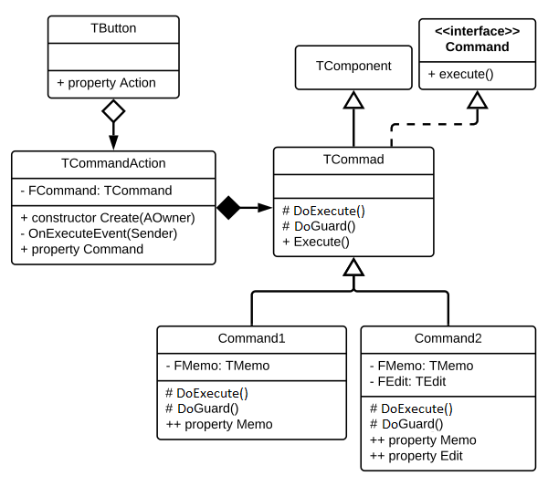

# Command Pattern for Delphi


## Overview

Simplified version of the GoF Command Pattern, created for the purposes of modernization of VCL projects. Also added action factory to this project, which is wrapping a command into VCL action.

## The Command Pattern


## Implementation

The project contains two versions of the pattern implementation:
1) classic Gang of Four `ICommand` interface
1) VCL `TCommand` class based on TComponent

## Modernization process

The `TCommand` component was created to help the **modernization of the legacy VCL code**. It assists the extraction of tangled code, which after securing it with unit tests, can be refactored into cleaner and cheaper to maintain object-oriented code.

`TCommand` component is a transition object that should be refactored after clearing extracted code and after removing UI dependencies


## TCommand component

The easiest way to use the `TCommand` component is to create a new class, paste long method into Execute method and add all dependencies as published properties. See sample bellow.

Diagram of TCommand usage in the VCL application:



## Creating / implementing new command

Developer to build new command needs to define new class derived from `TCommand` (unit: `Pattern.Command.pas`). He has to implement two protected methods: `DoGuard` and `DoExecute`: 
* *method* `DoGuard` - can be empty if there is no injection (injection system is explained bellow)
* *method* `DoExecute` - contains code which is main logic of the command

Both methods are `virtual` then defining their interface have to use `override` keyword. You can remove (not to add) `inherited` call from `DoExecute` implementation and you have to remove this call from `DoGuard` implementation, if not then during first call exception will be raise with message that you cant call base `TCommand.DoGuard` code. This safeguards that developer implemented its own `DoGuard` logic.

Sample command without injection (empty guard):
```pas
type
  TDiceRollCommand = class (TCommand)
  protected
    procedure DoGuard; override;
    procedure DoExecute; override;
  end;

procedure TDiceRollCommand.DoGuard;
begin
  // Required: even if no injection are provided 
end;

procedure TDiceRollCommand.DoExecute;
begin
  ShowMessage('Dice roll: '+RandomRange(1,6).ToString);
end;
```

To execute command you should create object and call `Execute` public method, which call `DoGuard` and then `DoExecute`. You shouldn't put any business logic into guard method, see bellow section about injection system for more details.

Sample call:

```pas
cmd := TDiceRollCommand.Ceate(Self);
cmd.Execute;
```

## TCommand injection system

`TCommand` component has built in automated injection system based on classic `RTTI` mechanism used by IDE Form Designer (Object Inspector). Properties exposed to be injectable have to be defined in `published` section of the component (command). All component based classes have switched on run-time type information generation during compilation process (compiler option `{$TYPEINFO ON}`). Thanks of that during creation of new command all dependencies can be easily provided and assigned to published properties automatically. More information about classic RTTI engine can be find in Delphi documentation: [Run-Time Type Information](http://docwiki.embarcadero.com/RADStudio/Rio/en/Run-Time_Type_Information_\(Delphi\))

Sample command with two dependencies (one required and one optional):
```pas
type
  TDiceRollCommand = class (TCommand)
  const
    RollCount = 100;
  private
    FOutput: TStrings;
    FProgressBar: TProgressBar;
    procedure ShowProgress(aRoll: integer);
  protected
    procedure DoGuard; override;
    procedure DoExecute; override;
  published
    property OutputRolls: TStrings read FOutput 
      write FOutput;
    property ProgressBar: TProgressBar read FProgressBar 
      write FProgressBar;
  end;

procedure TDiceRollCommand.DoGuard;
begin
  System.Assert(FOutput<>nil); 
end;

procedure TDiceRollCommand.ShowProgress(aRoll: integer);
begin
  if Assigned(ProgressBar) then begin
    if aRoll=0 then
      ProgressBar.Max := RollCount;
    ProgressBar.Position := aRoll;
  end;
end

procedure TDiceRollCommand.DoExecute;
begin
  ShowProgress(0);
  for var i := 0 to RollCount-1 do
  begin
    var number := RandomRange(1,6);
    FOutput.Add(number.ToString);
    if (FReportingMemo<>nil) then
      FReportingMemo.Lines.Add(number.ToString);
    ShowProgress(i+1);
  end;
end;
```

Available published properties of TCommand are matched against types of parameters passed in parameters (open array). Following rules are used by matching algorithm:

1. The same object types are matched
1. If there is two or more object of the same class passed and more matching properties then parameter are assigned to properties according to order first with first, second with second, etc.
1. More specific object passed as parameter is matching to more general object in properties list
1. Numeric integer parameters are assigned to numeric properties
1. Strings to strings
1. Supported are also decimals, enumerable and boolean types.

**Warning!** Injected object are accessed by address in memory (pointer), thanks of that any changes made to object are visible inside and outside of the TCommand. Simple types and strings are accessed via value and properties have to updated manually to be updated.

Sample code injecting objects to properties of TDiceRollCommand:
```pas
cmd := TDiceRollCommand.Create(Self)
  .Inject([Memo1.Lines,ProgressBar1]);
```

Most popular and usually advised method of injecting dependencies is a constructor injection. This solution introduced here (TCommand pattern) is more component based approach. This pattern is more like a transition stage which allow quickly extract and execute important parts of big application. Final target point in that process is the best architectural solution, means injection through the constructor and use interfaces instead of objects.

## TCommand execution

1) Instant (ad-hoc) command execution
    * `TCommand.AdhocExecute<T>` - executes a command (creates a command, injects dependencies executes it and removes)
1) Full command construction and execution 
    * Create command with standard (component) constructor
    * Call method `Inject`
    * Execute command with `Execute`
1) Build command invoker `TCommandAction` which executes the command when the action is invoked
    * `TCommandAction` class is classic VCL action
    * This class has special methods to allow rapid construction and initialization

## Asynchronous command

Block of a business logic, extracted into the command, can be easily converted into asynchronous execution using `TAsyncCommand` class. Asynchronous means that all code implemented in `DoExecute` method will be processed in a separate background thread. Today when each machine has access multiple CPU cores this functionality will allow to execute domain code in background, even in parallel, without any negative influence on displayed UI.

Introducing parallel programing into your project is not very simple in general, usually developers are struggling with many issues coming from that area, but in this days there is no other alternative and `TAsyncCommand` pattern can make this transition much easier.

Important rules during converting standard command into async one are:
1) Remove code manipulating UI controls
    - The best approach is to remove all such code  from `DoExecute` method and process everything without any visual feedback
    - if this is not possible remove as much as you are able
    - all other UI manipulation have to be done in a main thread: outside `DoExecute` or inside it but with `Synchronize` (more info bellow)
1) Do not share memory structures between treads (if possible)
   - Use memory structures only internally, for example if you want to access SQL server and fetch some data then create a dedicated new SQL connection for async command
   - You can crate a structure colones before async execution and read all results from internal structures after processing
1) If you have to share memory structures
   - Use proper concurrency control components like TMonitor to prevent parallel modification made by many threads
   - This is the most challenging scenario of parallel computing and proper solutions and patterns are far beyond the scope of this documentation.

## TCommand memory management

> TBD: Describe advantages of management base on `TComponent` solution using owner.

## TCommandAction - VCL command invoker

`TCommandAction` is a wrapper class based on `TAction` and is able to execute commands based on `TCommand` class. Developer, when building VCL application, can easily bind this action to many controls (visual components which are driven by actions or are action-aware). For example `TCheckBox` has `Action` property which is executed when used is changing checkbox state (checked). Actions have some other advantages like build in notification system, precisely two such engines: one for updating visual state and another, more internal, for notifying about creation of new and deletion of existing components. Both engines are too complex to be described in this section, more information can be found in the Delphi online documentation.

Looking form architectural perspective `TCommandAction` can be used as an Invoker object and after migration can be replaced by more elastic custom solution.

Sample construction on `TCommandAction` invoker:

```pas
Button1.Action := TCommandAction.Create(Button1)
  .SetupCaption('Run sample command')
  .SetupCommand(TSampleCommand.Create(Button1)
    .Inject([Memo1, Edit1])
  );
```

`TCommandAction` has some utility methods which allows to quickly initialize its behavior:

| Utility method | Description |
| --- | --- |
| `SetupCaption(ACaption)` | Sets action caption which is displayed in a control |
| `SetupShortCut(AShorcut)` | Sets shortcut which is activating action |
| `SetupCommand(ACommand)` | Sets command to execute |
| `SetupEventOnUpdate(...)` | Sets on update event (using anonymous method) |

Sample setup OnUpdate event in `TCommandAction`:

```pas
Button2.Action := TCommandAction.Create(Self)
  .SetupCaption('Run sample command')
  .SetupCommand(MySampleCommand)
  .SetupEventOnUpdate(
    procedure(cmd: TCommandAction)
    begin
      cmd.Enabled := CheckBox1.Checked;
    end);
```


## Samples

Ad-hoc command execution (create, inject, execute, remove)
```pas
TCommand.AdhocExecute<TSampleCommand>([Memo1, Edit1]);
```

Creates command and inject dependencies:
```pas
cmdSampleCommand := TSampleCommand.Create(AOwner);
cmdSampleCommand.Inject([Memo1, Edit1]);
```

Create invoker `TCommandAction`:
```pas
Button1.Action := TCommandAction.Create(Button1)
  .SetupCaption('Run sample command')
  .SetupCommand(TSampleCommand.Create(Button1)
    .Inject([Memo1, Edit1])
  );
```

Sample `TCommand` component:
```pas
type
  TSampleCommand = class (TCommand)
  private
    FMemo: TMemo;
    FEdit: TEdit;
  protected
    procedure DoGuard; override;
    procedure DoExecute; override;
  published
    property Memo: TMemo read FMemo write FMemo;
    property Edit: TEdit read FEdit write FEdit;
  end;

procedure TSampleCommand.DoGuard;
begin
  System.Assert(Memo<>nil);
  System.Assert(Edit<>nil);
end;

procedure TSampleCommand.DoExecute;
begin
  Memo.Lines.Add('Getting Edit text and put it here ...');
  Memo.Lines.Add('  * Edit.Text: '+Edit.Text);
end;
```
